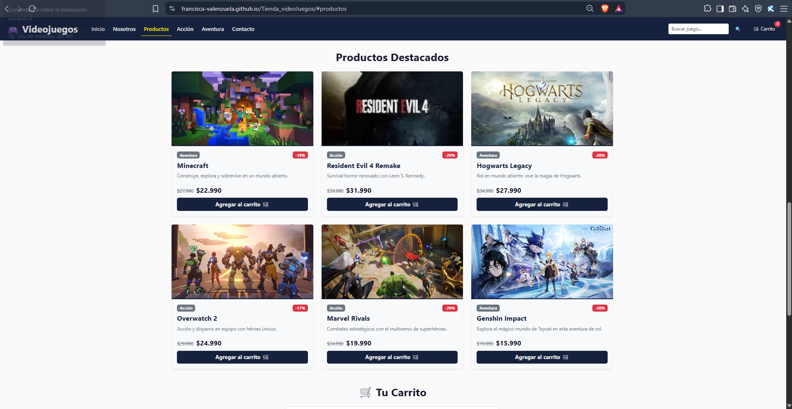
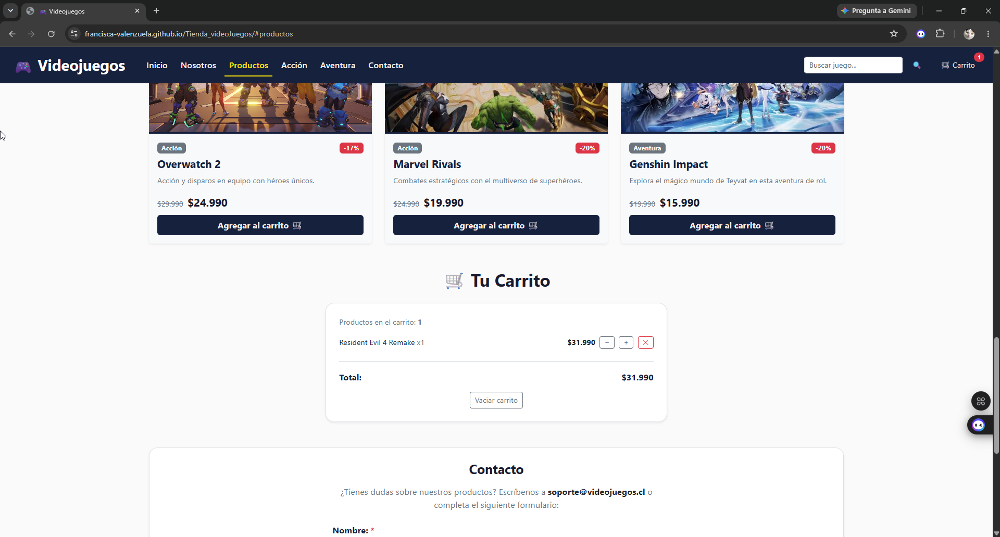
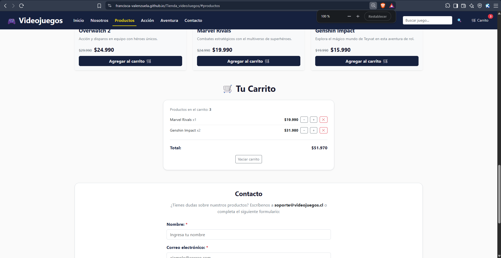
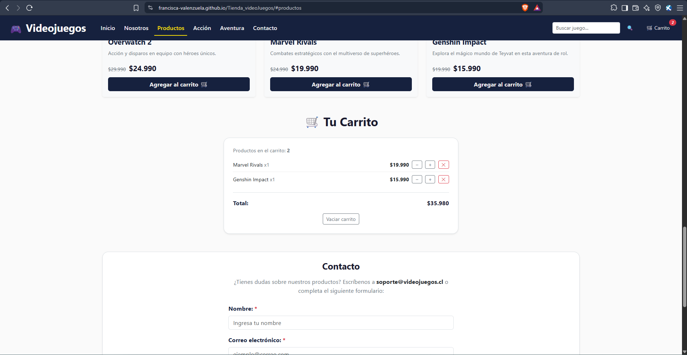
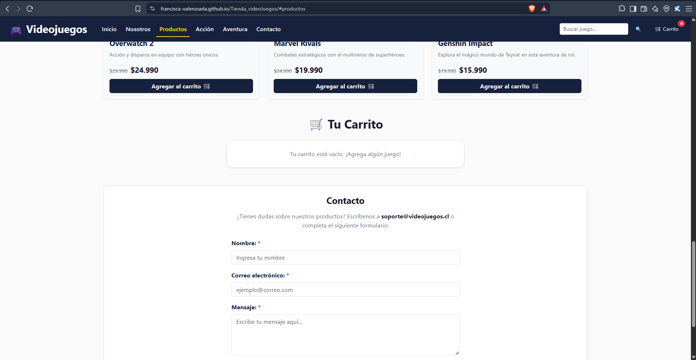
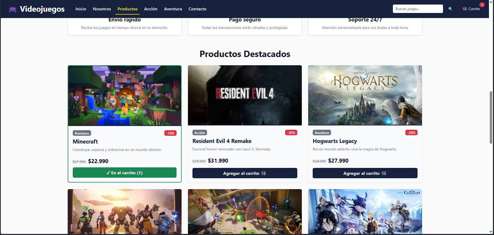
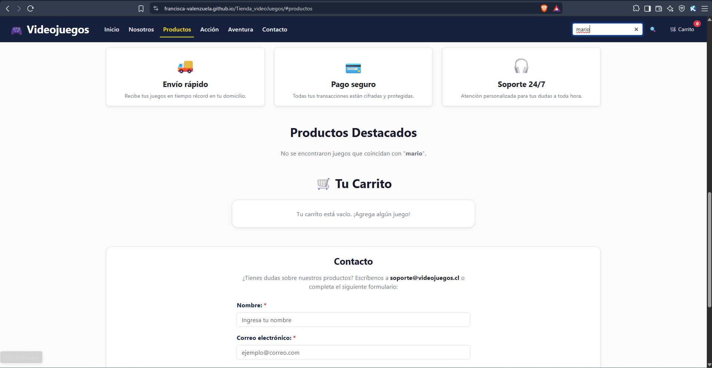
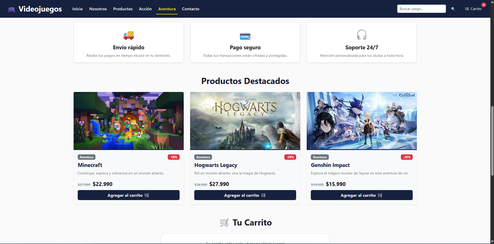
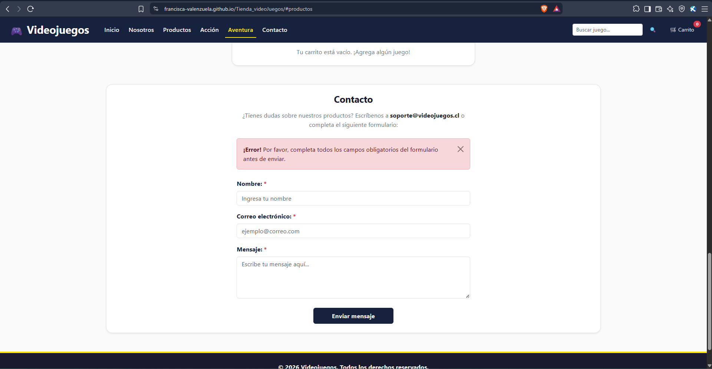

# 🎮 Tienda de Videojuegos – Evaluación Final Transversal (EFT)

Proyecto final desarrollado para la asignatura **Desarrollo Frontend I (PFY2201)**. Esta aplicación web es una tienda de videojuegos online interactiva construida bajo el ecosistema de **React** y **Vite**, integrando un diseño responsivo y accesible mediante **Bootstrap 5**.

- 🔗 **Sitio publicado (Live Demo):** [Tienda de Videojuegos en GitHub Pages](https://Francisca-Valenzuela.github.io/Tienda_videoJuegos/)
- 📦 **Repositorio Oficial:** [Francisca-Valenzuela/Tienda_videoJuegos](https://github.com/Francisca-Valenzuela/Tienda_videoJuegos)
- 👩‍💻 **Desarrolladora:** Francisca Valenzuela

---

## 🚀 Funcionalidades Principales

El proyecto cumple con los requerimientos técnicos de la industria y la rúbrica académica, destacando las siguientes características:

1. **Carga Dinámica de Datos (Fetch API):** El catálogo de productos se renderiza asincrónicamente consumiendo un archivo `productos.json` utilizando el hook `useEffect` y manejando ciclos de vida con `AbortController` para evitar fugas de memoria.
2. **Interactividad y Estado (React Hooks):** 
   - Filtrado en tiempo real por categoría (Acción / Aventura) y barra de búsqueda optimizada con `useMemo`.
   - Carrito de compras modularizado a través de un Custom Hook (`useCarrito.js`) que gestiona el estado (agregar, sumar, restar, eliminar y vaciar) estabilizado con `useCallback`.
3. **Renderizado Condicional:** Modificación dinámica de la Interfaz de Usuario (UI). Si un producto está en el carrito, el botón de la tarjeta (`ProductCard.jsx`) cambia visualmente a "✓ En el carrito (n)" y resalta sus bordes. Se manejan estados de carga (Loading) y error.
4. **Validación de Formularios y Accesibilidad:** Formulario de contacto (`ContactForm.jsx`) con validación de datos mediante expresiones regulares (RegEx) para correos electrónicos. Integración de atributos `aria-live`, `aria-hidden` y alertas dinámicas de Bootstrap para asegurar el soporte a lectores de pantalla.
5. **Diseño Responsivo (Mobile First):** Estructuración de layouts utilizando el Grid System de Bootstrap 5 (`col-12 col-sm-6 col-lg-4`), garantizando una adaptabilidad perfecta en smartphones, tablets y pantallas de escritorio.

---

## 🛠️ Tecnologías y Herramientas

- **Core:** HTML5, CSS3, JavaScript (ES6+).
- **Librería/Framework:** React 18, Vite.
- **Estilos y Maquetación:** Bootstrap 5.3 (CDN), CSS Custom Properties.
- **Despliegue:** GitHub Pages (`gh-pages`).

---

## 📂 Estructura del Proyecto

El código fuente está modularizado siguiendo las mejores prácticas de arquitectura Frontend:

```text
src/
├── components/       # Componentes funcionales de React
│   ├── Alerta.jsx
│   ├── Beneficios.jsx
│   ├── Carrusel.jsx
│   ├── CartItem.jsx
│   ├── CartTotal.jsx
│   ├── ContactForm.jsx
│   ├── Footer.jsx
│   ├── Hero.jsx
│   ├── Navbar.jsx
│   ├── ProductCard.jsx
│   ├── ProductList.jsx
│   └── ShoppingCart.jsx
├── hooks/            # Hooks personalizados
│   └── useCarrito.js
├── utils/            # Funciones de utilidad (ej. formateo de moneda)
│   └── formatearPrecio.js
├── App.jsx           # Componente raíz y gestión de estados globales
├── main.jsx          # Punto de entrada de la aplicación
└── index.css         # Estilos globales y variables CSS
public/               # Activos estáticos
├── img/              # Imágenes de los videojuegos
└── productos.json    # Base de datos simulada (API local)
```

## Cómo ejecutarlo
```bash
npm install
npm run dev        # http://localhost:5173/Tienda_videoJuegos/
npm run build
npm run deploy     # publica en la rama gh-pages
```

## Capturas de pantalla
| Funcionalidad | Captura |
|---|---|
| Listado de productos cargados dinámicamente |  |
| Agregar al carrito y alerta |  |
| Carrito con contador y total |  |
| Eliminar / restar producto |  |
| Carrito vacío |  |
| Botón "En el carrito" (renderizado condicional) |  |
| Búsqueda sin resultados |  |
| Filtro por categoría |  |
| Formulario de contacto |  |
| Vista móvil |  |